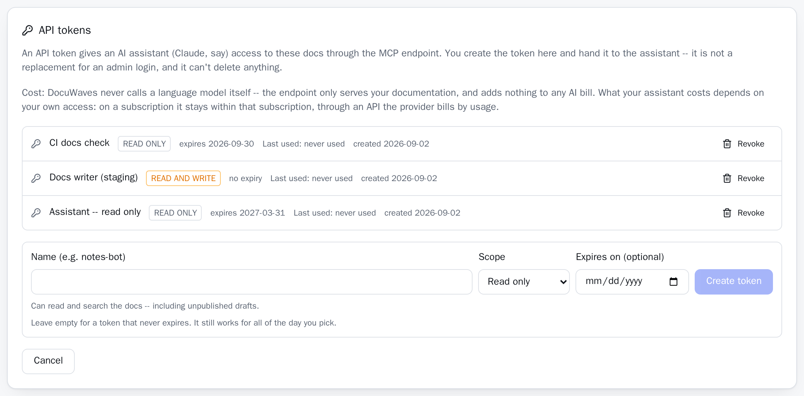

## Creating one

Admin area → **API tokens** → give it a name, pick a scope, optionally set an expiry date → **Create token**.

The value (`dwt_…`) is shown **exactly once**, right there, and is never recoverable. Only a SHA-256 hash of it is stored. Lose it and you make a new one.

The list afterwards shows the name, the scope, the expiry, when it was created and when it was last used — never the value.

The `dwt_` prefix is not decoration. A value starting with it is recognisable as a DocuWaves token in a log, a config file or a leaked paste, which is what lets a secret scanner — or a person — spot one that has ended up somewhere it should not be.

## The two scopes

| | `read` | `write` |
|---|---|---|
| `list_projects`, `list_pages`, `read_page`, `search` | yes | yes |
| `create_project`, `create_page`, `update_page`, `create_category` | **no** | yes |

`write` implies `read`. There is no write-only token, because every write tool has to look the existing content up first — which project, which category, which page — and a scope that forbade that would describe a token that cannot be used.

There is a third scope, **sync**, for a different job: a code repository's
CI replacing one project's content ([docs-as-code](/p/docuwaves/pages/docs-as-code)).
A sync token is tied to one project, works only at `/api/sync/<project>`, and
cannot reach the MCP endpoint at all — nor can a read or write token sync.

**A token's scope cannot be changed.** If a `read` token needs to write, issue a new one and revoke the old.

A `read` token calling a write tool gets an explicit refusal naming the scope it has, the scope it needs, and the tools it *can* use — not a generic failure it will retry forever.

**Both scopes can see unpublished drafts.** That is the point: an assistant asked to finish a draft has to be able to read it. Only `search` is published-only, because it is the same index the public search box uses. If a draft would be a problem to share, it is a problem to hand out any token for.

## Expiry

Optional. A date, not a timestamp, because a date is what you pick in the form — and "it stops working some time during the day I typed" would be a surprise. A token set to expire on 2026-09-01 works for all of 2026-09-01.

Leave it empty for a token that never expires. A value that is not a parseable date counts as **expired**, not as never-expiring: the only way the column holds something else is a hand-edited database, and the safe reading of a broken expiry is that the token is done.

## Revoking

**Revoke** deletes the row. It takes effect on the very next request.

There is no "revoked" flag, because a revoked token has nothing left worth keeping: its value is unrecoverable, and the only two facts about it — what it was called and when it was last used — are exactly the two you just looked at before deciding to revoke it.

The `last used` column is there so a token nothing has touched in months is easy to spot.

## Where tokens live, and why it is not where everything else lives

Projects, categories, pages, images and branding are all files in the content repository, because that repository is the source of truth and the database is only a rebuildable index over it.

**A token inverts that reasoning.** It is a credential, and the content repository's entire purpose is to be cloned, forked and read in a pull request by people who are not you. A token committed there would be published by the very thing that makes the repository useful.

So it goes in the database, next to the admin account and the session table — the tables the schema rebuild deliberately never drops. A reindex, a new image, a lost-and-recloned content repository: none of them touch a token.

The hash is plain SHA-256 rather than bcrypt, unlike the admin password beside it. There is nothing to guess here — a token is 32 random bytes, so the search space is 2^256 and no amount of hashing slowness changes that answer. What bcrypt *would* change is that its deliberate slowness would sit on every single request an assistant makes.

An instance is capped at 50 live tokens. More than that is a sign nobody is revoking anything.

## The security warning, plainly

**A `write` token lets whoever holds it change your documentation.** Not "has elevated permissions" — it means the holder can rewrite a published page, publish a draft, and add pages and projects, across this whole instance.

It is scoped to documentation. It cannot delete anything, cannot touch branding, cannot create another token, and cannot reach the rest of the admin API. But within that, it is real write access to what your readers see.

**A token is not an account.** It has no [role](/p/docuwaves/pages/accounts-and-roles), it cannot be given one, and its two scopes describe documentation rather than the admin API — a `read` token that could reach `/api/admin/*` would be able to delete a project, which is exactly the authority this arrangement withholds. The rule runs the other way too: a browser session is refused at `/api/mcp`, because every answer there depends on the caller's scope and a session has none.

- Hand a write token to an assistant you are actually supervising, and **read the commits it produces**. They are attributed — see [What an assistant can and cannot do](/p/docuwaves/pages/what-an-assistant-can-and-cannot-do).
- Give it an **expiry date**. A token for one documentation sprint should stop working when the sprint ends.
- Use a **read** token whenever reading is all that is needed. It is the default in the form for that reason.
- **Revoke** rather than leave it lying around.
- Remember that both scopes read drafts.
