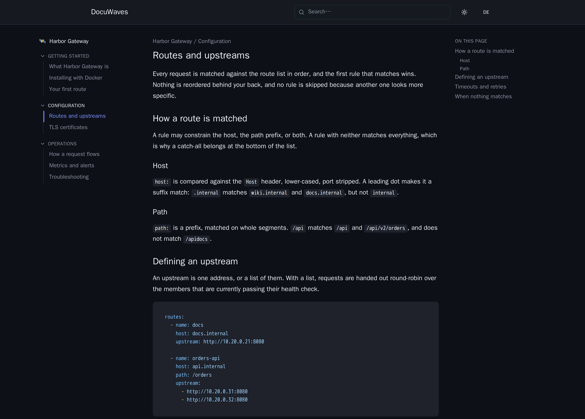

Every DocuWaves instance carries its own name, logo, colour and footer, and that identity lives in the content repository:

```
content/_site.yml          <- the branding file (every field optional)
content/_site/             <- its images
  logo.png
  logo-white.png
  favicon.png
```

## Why it is in the repository and not in the database

Because the database is only a rebuildable index over the files. Branding kept there would disappear the moment the index was rebuilt or the `/data` volume was lost — taking the site's identity with it.

In the repository it is versioned, reviewable in a pull request, and restored by the same `git clone` that restores every page.

It also means **branding is per instance, automatically.** One deployment pointed at a company's docs repository and another pointed at a tool's own docs repository look like two different products, without either needing its own build, its own image or an environment variable.

## The file

Every field is optional, and so is the file itself:

```yaml
languages: [de, en]                   # optional; omit for a single-language site
name: SyntaxLab Docs                  # header, and the browser tab title
tagline: Documentation for every tool # one line under the name on the home page
logo: logo.png                        # a file in _site/; omit for text only
logo_dark: logo-white.png             # optional, used in dark mode
favicon: favicon.png                  # optional
accent: "#00d4d5"                     # accent colour, #rgb or #rrggbb
footer_text: © 2026 SyntaxLab         # optional
footer_links:                         # optional
  - label: Imprint
    url: https://example.com/imprint
```

| Field | What happens when it is absent |
|---|---|
| `languages` | Single language: no URL prefix, no switcher, no per-language fields — see [Enabling a second language](/p/docuwaves/pages/enabling-a-second-language) |
| `name` | `DocuWaves`. It is the header text and the tab title: a page reads `<page title> · <site name>`, the home page just the site name |
| `tagline` | A generic "choose a project" line on the home page |
| `logo` / `logo_dark` | No image; the name renders as text. `logo_dark` falls back to `logo`, so one file works for both modes |
| `favicon` | The shipped DocuWaves icon |
| `accent` | The built-in accent, which is deliberately a different value in light and dark mode |
| `footer_text` / `footer_links` | No footer at all |

`accent` must be `#rgb` or `#rrggbb`. Anything else falls back to "keep the built-in accent" — the value is written into a CSS custom property, so `red; background: url(...)` must never reach the stylesheet.

Readers switch between light and dark from the header, and both are the same page — the palette and the accent change, nothing else does:



A `footer_links` entry needs a `label` and a `url` starting with `http://`, `https://`, `mailto:` or `/`. The scheme is allow-listed rather than blocked, which rejects `javascript:` and `data:` without having to guess at every other scheme a browser might one day treat as executable. At most twelve links; one malformed row is dropped and the rest of the footer still renders.

On a multi-language instance, `name`, `tagline` and `footer_text` each accept a per-language mapping instead of a string.

## Editing it in the browser

**Branding** in the admin header opens a panel with the site name, the tagline, a colour picker, footer text, footer link rows, and upload buttons for the three images — plus a live preview of the header as you type. Saving writes `_site.yml`, commits it as `Update site branding`, and pushes it.


Two things about that form:

- **`languages:` is shown but not editable.** It decides how every page file in the repository is named; it is changed in the file. See [Enabling a second language](/p/docuwaves/pages/enabling-a-second-language).
- **The panel is admin-only.** Branding is what the instance claims to be, so it sits with the other instance-level settings rather than with the documentation — an account with the **Write** role edits every page and not this. See [Accounts and roles](/p/docuwaves/pages/accounts-and-roles).
- **The form is the whole file's editor.** Keys it does not know about are not carried over on save. That is an honest round-trip rather than silently re-emitting something the form cannot show — but it does mean hand-added keys do not survive a save from the browser.

Hand-editing the file in the repository, or changing it by pull request, works just as well.

## The images

Files in `content/_site/` follow exactly the same rules as a project's images — allowed types, the 10 MB limit, contents checked against the extension, SVGs screened and served with a restrictive `Content-Security-Policy`, and no path escaping the folder. It is the same code, with `_site` in the place of a project slug.

A `logo:` naming a file that is not there yields **no image at all**, and the header falls back to the site name as text. Nothing 404s and nothing shows a broken image.

## Nothing in this file can take the site down

A missing file, an empty one, broken YAML, a field holding the wrong type, a key DocuWaves does not know, a colour that is not a colour, a `javascript:` footer link, a logo naming a file that is not there — each one falls back to its default and the bad value is logged. Erroring the public site over a typo in a file anyone can send a pull request for would be the wrong trade.

## Analytics live in the same panel

Two more fields at the bottom of the form turn on optional
[Umami analytics](/p/docuwaves/pages/analytics). They are off by default, and
they are the only third-party script this application will ever put on a
public page.
