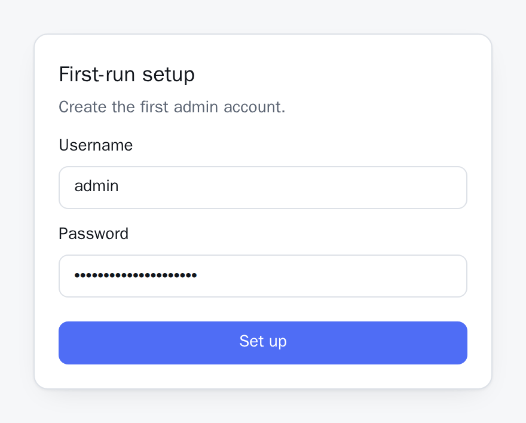
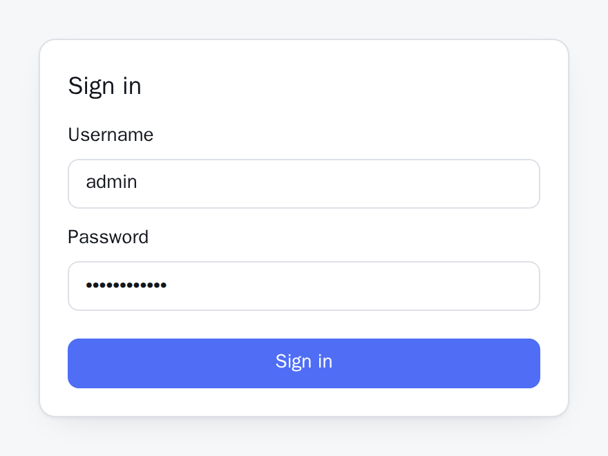

## Create the first account

The first page a fresh instance shows is **First-run setup**: a username and a password. The password needs at least eight characters. That account is an **administrator** — the only role that can create the others, so the first one has to be it.



Until it exists, the whole API is closed. Every route under `/api/` except the login flow itself and the public read-only endpoints answers `401 setup_required` — API tokens included, since there is nobody yet who could have created one.

If you configured [single sign-on](/p/docuwaves/pages/single-sign-on) before the first start, you can skip this screen: on an instance with no account yet, the first successful SSO login creates the administrator account from your SSO username. After that, SSO only signs in accounts that already exist here.

Everybody else is added afterwards, under **Accounts**, with the role they need — see [Accounts and roles](/p/docuwaves/pages/accounts-and-roles).

Once the account exists, `/admin` shows the ordinary sign-in form instead, and the setup screen is never offered again:



## Check the content repository

The admin area shows a status bar above everything else, and what it says depends on how you started.

With no `CONTENT_REPO_URL` set, it reads **Content versioned locally (no remote)**. That is the normal state for a local install: every change is still a real commit with a full history, there is simply nowhere to push it, so there is no **Sync now** button either — nothing exists to fetch from.

With a remote configured it reads **Content repo connected**, with the branch and the last commit it has seen, and **Sync now** appears next to it: it fetches from the remote and rebuilds the index.

If it reads **Content repo unreachable**, the message underneath is Git's own — a bad credential, a wrong URL, a host that cannot be reached. Nothing is hidden behind a generic failure.

On a genuinely empty remote you will already see one commit: DocuWaves cannot check out a branch that does not exist, so it initialises the repository locally on your configured branch, makes a first commit, and pushes it as the branch's first ever commit.

If you started locally and add a remote later, the history you already have is pushed to it — nothing is discarded and nothing is re-cloned over the top.

## Write something

Work top down. Each step is a real commit, pushed immediately.

1. **New project** — a project is one piece of software or one product, not one topic. Its name sets its slug, and the slug is in every URL underneath it, so pick the name you mean to keep.
2. **New category** — the grouping between a project and its pages. Categories are shown as tiles on the project page and as sections in the sidebar.
3. **New page** — a title and a body of Markdown. The **Preview** tab renders it as readers will see it.
4. **Published** — until you switch it on, the page exists only in the admin area and in the content repository.

Then look at your content repository's history. There should be one commit per action, authored under the username you signed in with:

```bash
git log --oneline
```

```
9f2c1ab Publish page: Installation
4be77d0 Add page: Installation [default]
1d05e3e Add category: Getting Started (My Project)
7a4402c Add project: My Project
c0ffee1 Initial commit (DocuWaves content repo bootstrap)
```

If those commits are there, the whole chain works: editor to file to commit to push.

## Why the home page may still look empty

A project with **no published pages does not appear on the public site** — not on the home page and not in `/sitemap.xml`. It is still fully present in the admin area. So between creating a project and publishing its first page, the public home page correctly shows nothing.

That is not a bug to work around; it is also the mechanism for keeping a private set of notes in the same instance. There is more on it in [Drafts and publishing](/p/docuwaves/pages/drafts-and-publishing).

## Where to go next

- Write pages: [Projects, categories and pages](/p/docuwaves/pages/projects-categories-and-pages).
- Understand what is now in your repository: [The file layout](/p/docuwaves/pages/the-file-layout).
- Make it look like yours: [Branding this instance](/p/docuwaves/pages/branding-this-instance).
- Put it on a domain: [Behind a reverse proxy](/p/docuwaves/pages/behind-a-reverse-proxy).
- Let somebody else in: [Accounts and roles](/p/docuwaves/pages/accounts-and-roles).
