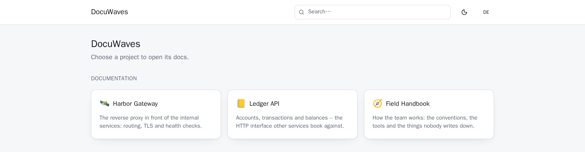
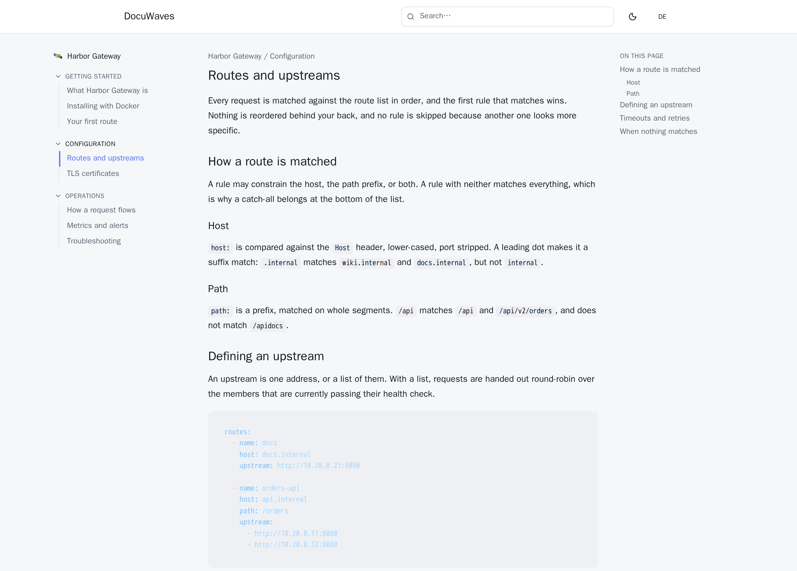

DocuWaves is a self-hosted documentation site. You run it yourself, in one container, and one deployment serves the documentation for as many projects as you maintain — visitors land on a shared home page and click through to the project they came for.

The part worth understanding before anything else is **where the content lives**. Every project, category and page is a plain file — Markdown with a short YAML header — in a *separate* Git repository that you own. DocuWaves clones that repository, builds an index over it, and serves it. When you save a page in the browser editor, DocuWaves writes the file, commits it, and pushes it. Nobody has to touch `git` to use the editor, and nothing stops anyone from bypassing the editor entirely.

## Why the content is in Git

Three things follow from that decision, and they are the reason for it:

- **Your documentation outlives this application.** The files are Markdown. If DocuWaves disappeared tomorrow, you would still have a repository full of readable, portable pages.
- **Contribution works the way contribution already works.** Someone can fork the content repository, edit a `.md` file, and open a pull request. DocuWaves picks up the merged change on its own. No account on your instance is required to propose a change.
- **There is no separate backup story for content.** The full history, with authorship, is the repository's history. `git log` and the app's own history panel are the same answer.

The database — SQLite by default — is only ever a **rebuildable search and browse index** over those files. It holds no content of its own. Delete it and DocuWaves rebuilds it from the working clone on the next start. That is not a caveat; it is the design, and it is what makes several other things in these docs safe to say.

## What you get

- **Several projects in one instance**, each with its own categories and pages.
- **Categories as tiles** on a project's landing page, so its shape is visible at a glance — with a contents sidebar and previous/next links once you are inside a page.
- **GitHub-flavored Markdown** with tables, task lists and syntax-highlighted code, written in a plain editor with a preview a tab away.
- **[Diagrams as text](/p/docuwaves/pages/diagrams)** — a fenced code block tagged `mermaid` is drawn as a real diagram.
- **[Images](/p/docuwaves/pages/images)** you can upload, paste from the clipboard, or drag onto the editor.
- **[Drafts](/p/docuwaves/pages/drafts-and-publishing)** — a page stays invisible until you publish it, and a [preview link](/p/docuwaves/pages/draft-preview-links) shows one to a named person before it goes live.
- **[Templates](/p/docuwaves/pages/page-templates)** for a new page — a how-to, an API reference, release notes, a course module.
- **[Formulas, video and audio](/p/docuwaves/pages/formulas-video-and-audio)** alongside the text.
- **[Printing](/p/docuwaves/pages/printing-and-pdf)** that produces a readable page with a QR code back to the live one — which is also how a PDF is made.
- **[A review note](/p/docuwaves/pages/review-notes)** — who checked a page and when, dropped again the moment the text changes.
- **[What readers say](/p/docuwaves/pages/reader-feedback-and-link-checking)** — a "was this helpful?" report, and a checker for links that no longer go anywhere.
- **Full-text search** across every published page in every project.
- **[Per-instance branding](/p/docuwaves/pages/branding-this-instance)** — name, logo, colour and footer come from the content repository, so two deployments look like two different products without either needing its own build.
- **Real HTML for crawlers.** Every public URL is answered with its own title, description, Open Graph tags, canonical link and structured data, written by the server before the response leaves it — so pasting a link into Slack or Discord shows *that page*, not the app shell.
- **Optional [languages](/p/docuwaves/pages/enabling-a-second-language) and optional [versions](/p/docuwaves/pages/freezing-a-version).** Both are off until you ask for them, and an instance that never asks behaves as though neither existed.
- **An [MCP endpoint](/p/docuwaves/pages/the-mcp-endpoint)** so an AI assistant can read and — with a token that says so — write the documentation, with every change arriving as an ordinary commit.
- **[Accounts with three roles](/p/docuwaves/pages/accounts-and-roles)** — read, write, manage — so the person who reviews a page need not be able to change it.
- **[Diagnostics](/p/docuwaves/pages/diagnostics) and a one-file [export](/p/docuwaves/pages/backups-and-updates)** of the whole instance.
- **Optionally [analytics](/p/docuwaves/pages/analytics) and a [documentation chat](/p/docuwaves/pages/the-documentation-chat).** Both are off until you configure them, and an instance that never does makes no third-party request at all.

## Who it is for

Someone who maintains software and wants its documentation on their own infrastructure, in their own repository, without a SaaS account in the middle. It suits a single maintainer or a small team well. It suits a project that wants outside contributions particularly well, because the contribution path is a pull request against a Markdown file.

## What it is not

- **Not a permission system.** There are [accounts and four roles](/p/docuwaves/pages/accounts-and-roles), which is enough to separate reading private docs from reviewing, reviewing from writing, and writing from administering. There is no per-project or per-page permission: an account that may edit may edit everything.
- **Approval is optional, and simple.** By default a page goes live when somebody switches **Published** on. A project can [require a second person's approval](/p/docuwaves/pages/approval-before-publishing) instead — four eyes, nothing more: no signatures, no audit beyond the Git history.
- **Not a static site generator.** Pages are served from a running application, which is what makes search, the editor and the assistant endpoint possible.
- **Not a wiki.** There are no comments, no discussion pages and no per-reader accounts.

Next: [Requirements](/p/docuwaves/pages/requirements).
