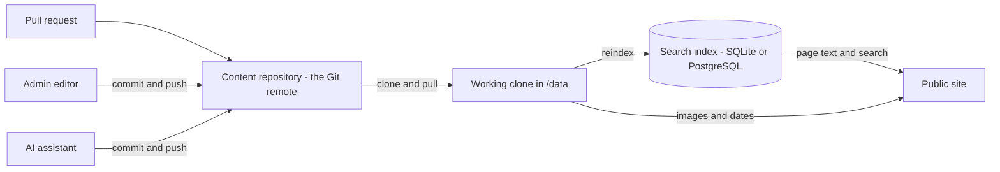

This is the on-disk convention DocuWaves reads and writes — and the shape a contributor's pull request should follow.

```
content/
  _site.yml                     <- this instance's branding (optional)
  _site/                        <- the images it points at
    logo.png
  _variables.yml                <- variables for the whole site (optional)
  _snippets/                    <- snippets for the whole site (optional)
  <project-slug>/
    _project.yml
    _variables.yml              <- this project's variables (optional)
    _snippets/                  <- this project's snippets (optional)
    _sync.yml                   <- docs-as-code: which page came from which file
    assets/
      dashboard.png
      imported/                 <- images brought in by an import
      sync/                     <- images owned by docs-as-code syncs
    <category-slug>/
      _category.yml
      <page-slug>.md            <- the default language
      <page-slug>.<lang>.md     <- the same page in another language
      <another-page-slug>.md
      _pending/                 <- changes waiting for approval
        <page-slug>.md
    <another-category-slug>/
      _category.yml
      ...
  <another-project-slug>/
    ...
```

[Snippets and variables](/p/docuwaves/pages/snippets-and-variables), the
proposals of the [approval workflow](/p/docuwaves/pages/approval-before-publishing)
and the file map of [docs-as-code](/p/docuwaves/pages/docs-as-code) are all
files too — so they travel with the repository like everything else.

Names starting with an underscore directly inside `content/` are reserved for DocuWaves itself and are never read as a project, so `_site/` cannot turn into a phantom project tile on the home page — not even if someone drops a `_project.yml` into it.

A project that has frozen a [documentation version](/p/docuwaves/pages/freezing-a-version) has **one extra directory level** between itself and its categories. Every project starts without it and keeps working without it forever.

## The three files

`_project.yml`:

```yaml
name: My Project
icon: 🚀
color: "#5b8def"
image: assets/cover.png
description: A short one-line description shown on the home page tile.
order: 0
```

`_category.yml`:

```yaml
name: Getting Started
icon: 📘
image: ../assets/getting-started.png
order: 0
```

A page — YAML frontmatter, then the Markdown body:

```markdown
---
title: Installation
order: 0
published: true
---

Install it like this.
```

Every field is described in [YAML and frontmatter fields](/p/docuwaves/pages/yaml-and-frontmatter-fields). The format is the same one Jekyll, Hugo and MkDocs use, so it will look familiar and it is not a lock-in.

## Files are the truth; the database is an index



Read that diagram in one direction: **everything flows out of the repository.** Three kinds of writer commit to it, DocuWaves keeps a working clone of it under `/data`, and the index is built from that clone. Nothing flows the other way. On any divergence, the filesystem wins and the database row is overwritten or removed to match it.

The practical consequences are worth stating plainly, because several other pages depend on them:

- **Losing the database is not losing content.** Delete it and DocuWaves rebuilds it from the clone on the next start.
- **Branding lives in the repository** for exactly this reason. A logo kept only in a database row would disappear the moment the index was rebuilt.
- **A page's "last updated" date comes from Git**, not from the index, because the index's own timestamps move when it is rebuilt.
- **Images are served from the clone**, not from the database, which is why they are subject to the repository's boundaries rather than to a page's published state.

## What is *not* in the content repository

Five things. Four are credentials or session state:

- **[accounts](/p/docuwaves/pages/accounts-and-roles)** (a bcrypt hash each, and the role),
- **active sessions**,
- **[API tokens](/p/docuwaves/pages/api-tokens-and-scopes)** (a SHA-256 hash of each),
- **[preview links](/p/docuwaves/pages/draft-preview-links)** (a SHA-256 hash of each).

They live in the database instead, and the schema rebuild that drops and repopulates the content tables deliberately never touches them. The reasoning inverts for a credential: the content repository exists to be cloned, forked and read in pull requests, so anything secret committed there would be published by the very thing that makes the repository useful.

The fifth is not a credential but is kept out for a different reason:

- **["was this page helpful?" votes](/p/docuwaves/pages/reader-feedback-and-link-checking)**, because an anonymous click must not become a commit, and a repository taking a write per vote would be unusable.

That one is the only content-ish thing a fresh clone would not bring back, which is why the [export](/p/docuwaves/pages/backups-and-updates) carries it as a separate file.
