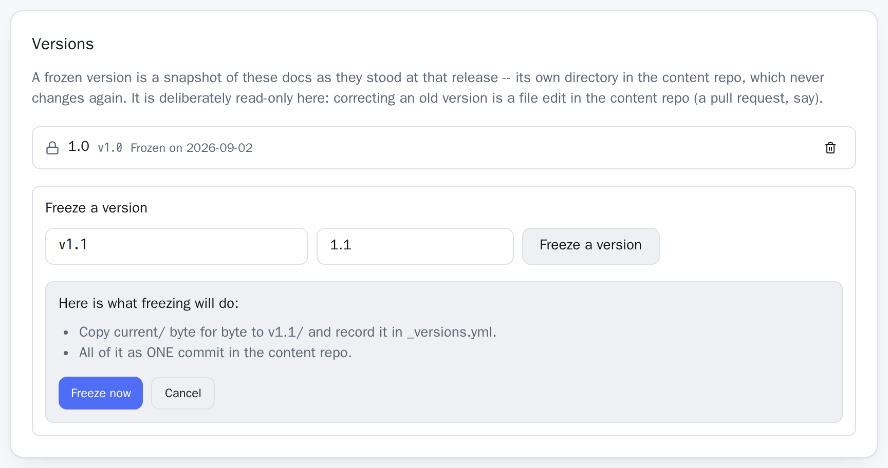

Versions are optional, and off until you ask for one. **A project with no `_versions.yml` keeps its categories and `assets/` directly under the project directory** and behaves exactly as it always has — no `current/`, no version in its URLs, no switcher. DocuWaves never creates the version level on its own.

Freeze a version when a release goes out and its documentation should stop changing while you keep editing the next one.

## What a version is

A **frozen snapshot directory**, not a Git branch:

```
content/
  cachepanel/
    _project.yml
    _versions.yml         <- which versions exist, and which one readers get
    current/              <- the working version; this is what the editor writes
      assets/
      getting-started/
        _category.yml
        installation.md
    v2.0/                 <- frozen at release: a byte-identical copy of current/
      assets/
      getting-started/
        ...
```

### Why a copy and not a branch

A released version of the docs has to keep saying what it said on release day while the current one is edited every week. A branch says the opposite: it is a line of development you merge, rebase and eventually delete, and reading an old one means checking it out — which one working clone can only do for one version at a time.

DocuWaves serves every version at once out of a single checkout, and a contributor's pull request has to be able to touch `v2.0` and `current` in the same diff. So duplication is the point: `v2.0/` is bytes nothing will ever rewrite. The cost is disk — Markdown files, next to nothing — and the payoff is that "what did 2.0 say?" is answered by looking in a directory.

## Freezing one

In the admin area, open a project and click **Versions**. Give the version:

- an **id** — `v2.0`. It becomes the directory name and the URL segment.
- a **label** — `2.0`. It is what the switcher shows.

The confirmation names exactly what is about to happen before it happens, then **Freeze now**.



On a project's **first** freeze, that includes a migration: the project's categories and `assets/` move into `current/`, then `current/` is copied to `v2.0/`, then `_versions.yml` is written — all as **one commit**, so the repository's history never contains a state where the project is in neither shape. You never move a file by hand.

## `assets/` moves with the version

Deliberately: a screenshot belongs to the version it documents, so 2.0's install page keeps showing 2.0's install screen.

This does **not** rewrite any page. A page still sits exactly one directory above `assets/` afterwards — `<project>/<version>/<category>/<page>.md` next to `<project>/<version>/assets/` — so every `` in the repository keeps resolving, inside DocuWaves and in GitHub's own file preview alike.

One consequence to know about: a **project's** cover image is version-independent, because `_project.yml` stays at the project level. An `image: assets/cover.png` set before the first freeze stops resolving afterwards, because the file moved to `current/assets/`. The tile falls back cleanly to its icon, and re-picking the cover in the project form stores the now-correct path.

## `_versions.yml`

```yaml
current_label: Current      # what the working version is called in the switcher
default: current            # which version an unprefixed URL shows
versions:                   # frozen ones, newest first
  - id: v2.0
    label: "2.0"
    released: 2026-08-01
```

Every field degrades on its own: a missing `current_label` becomes `Current`, a `default` naming a version that no longer exists falls back to `current`, and an entry that is not a usable mapping is dropped and logged. This file arrives by pull request like every other, so a typo in it must not take a project's docs down.

## Version ids are checked, not repaired

An id must be lowercase letters, digits, dots, dashes and underscores, starting with a letter or digit, at most 40 characters. Dots are kept on purpose — `v2.0` is a version *number*, and the slugifier the rest of the app uses would turn it into `v2-0`.

Refused rather than quietly fixed:

- `current`, `assets`, `c` and `pages` — each collides with a fixed segment of a reading URL or with the version's own assets folder;
- anything starting with `_` (reserved for DocuWaves' own files) or `.`;
- anything containing `/` or `\` — a version id is a single directory name;
- an id the project already has, or a directory of that name already present;
- a project with no content at all: there is nothing to freeze yet.

Refusing beats repairing here, because silently turning `../escape` into `escape` would create a directory you never asked for and never saw named.

A label is required, and a project is capped at 50 frozen versions — beyond that it is an archive, not a switcher, and the switcher is a row of links in a header.

Next: [After the freeze](/p/docuwaves/pages/after-the-freeze).
