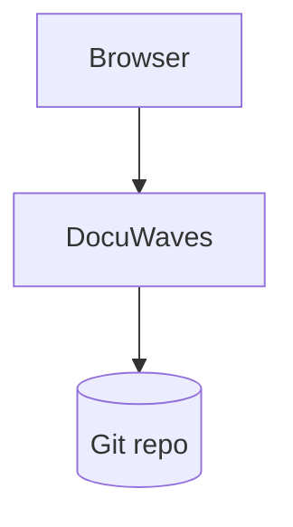

A fenced code block tagged `mermaid` is drawn as a diagram instead of printed as code:

````markdown

````

That is the whole of it. Nothing to install, nothing to upload, no `image:` to keep pointing at the right file. The syntax is [Mermaid](https://mermaid.js.org), so flowcharts, sequence diagrams, state machines, entity-relationship diagrams, Gantt charts and class diagrams all work; Mermaid's own documentation is the reference for what goes inside the block.

There is a worked example on [The file layout](/p/docuwaves/pages/the-file-layout).

## Why a diagram and not a screenshot of one

- It stays in the `.md` file, so it **diffs line by line** in a pull request the way the prose does.
- It **cannot drift out of date** while a picture in `assets/` stays as it was.
- It needs **no binary** in the repository.
- It **renders on GitHub, Gitea and Forgejo**, which draw `mermaid` fenced blocks in their own file previews. Same file, readable in both places — the same reason images are written as relative paths.

## What happens when the syntax is wrong

Which is most of the time while you are still typing one. The page does not break. That block shows the Mermaid source as a plain code block, and underneath it:

> This diagram could not be drawn — check the Mermaid syntax.
> `Parse error on line 2: ... Expecting 'SQE', 'DOUBLECIRCLEEND', ...`

— Mermaid's own message, which names the line. Everything else on the page, other diagrams included, renders normally. One broken diagram is one broken diagram, never a blank page.

The **Preview** tab draws diagrams exactly as the published page will, using the same component, so you find a syntax error before you publish rather than after.

## Details worth knowing

- **The copy button copies the source**, not the drawing. Copying the Mermaid source is what someone actually wants from a diagram in someone else's docs — to paste it into their own page and change three lines — and there is no other way to reach it, since the rendered diagram has replaced the code block it came from.
- **Light and dark are both handled.** The diagram is drawn in whichever palette the reader is on and is redrawn when they flip the switch, without a reload.
- **A wide diagram scrolls inside its own frame**, like a wide table or a long line of code. It never widens the page.
- **Page weight is paid only where it is used.** Mermaid is a large library, so it is loaded only when a page actually contains a diagram; a reader on a page without one never downloads it. It is bundled with the application and never fetched from a CDN, so an instance with no route to the internet draws its diagrams exactly like one with.
