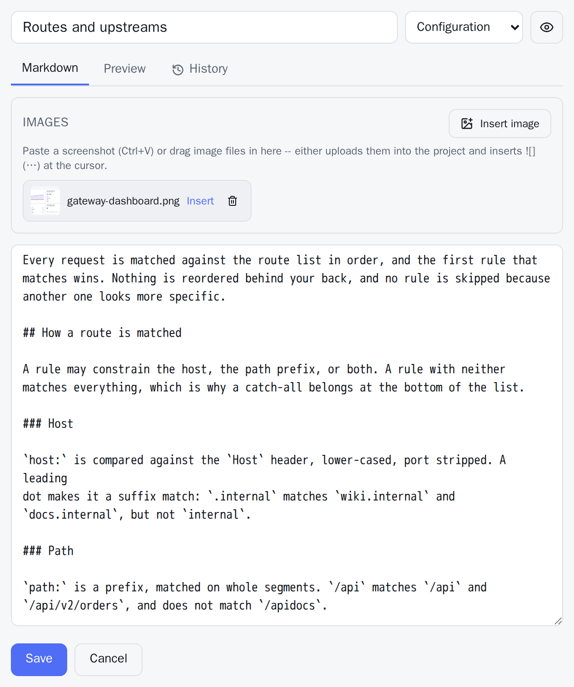
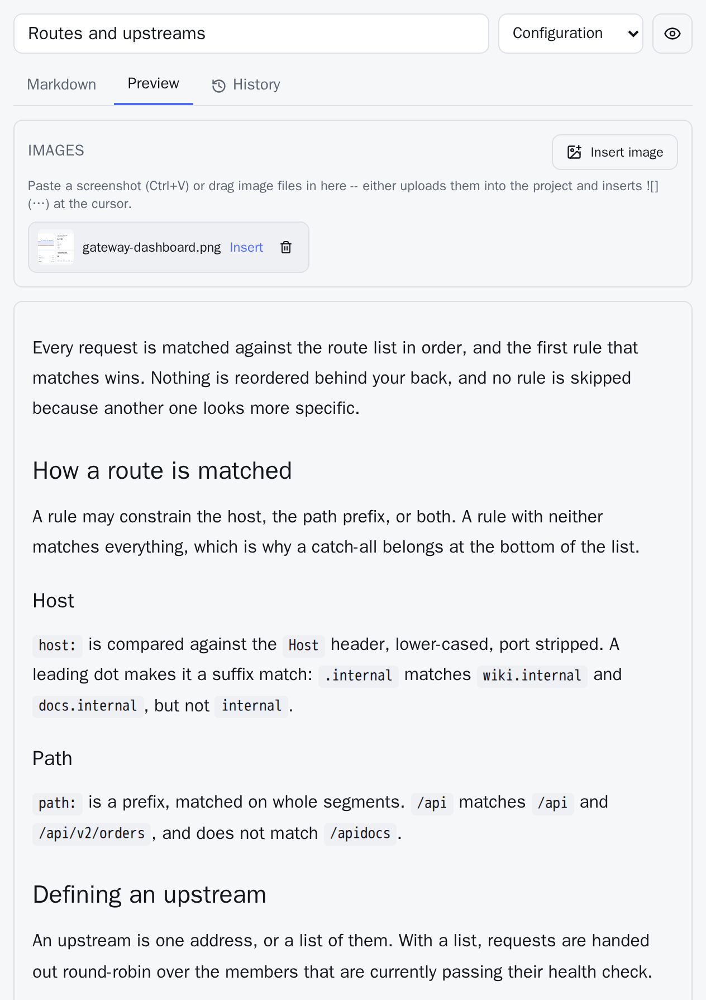

Pages are GitHub-flavored Markdown. If you have written a README, you already know the syntax.

## What is supported

Everything CommonMark defines, plus the GFM extensions:

| Feature | Example |
|---|---|
| Tables | pipe-separated cells with a `---` row under the header — this table is one |
| Task lists | `- [x] done` and `- [ ] not done` |
| Strikethrough | `~~gone~~` |
| Autolinks | a bare `https://example.com` becomes a link |
| Footnotes | `text[^1]`, with `[^1]: the note` further down |

Fenced code blocks are syntax-highlighted. Name the language after the opening fence:

````markdown
```bash
docker compose up -d --build
```
````

Every code block gets a **copy** button in the corner.

Two things behave differently from a plain Markdown renderer, and both are worth knowing:

- **Raw HTML is not rendered.** A `<div>` in a page is not a `<div>`; it is inert. Markdown is the whole vocabulary, deliberately, because these files are also read on GitHub and in text editors and by an assistant through the API.
- **Link targets are restricted.** `http`, `https`, `mailto` and `tel` links work, and so do site-relative links like `/p/docuwaves/pages/markdown`. Anything else — `javascript:` in particular — is stripped. Images may additionally use a `data:` URI, since an image is not a scripting context.

## Headings

Start at `##`. The page's title is already printed above the body, so a body opening with an `# H1` that repeats it has that duplicate removed automatically — you can paste a README in without editing its first line.

`##` and `###` headings get two things: a hover anchor for deep-linking, and an entry in the **On this page** contents beside the article. Deeper levels render normally but do not appear in the contents. Underlined (setext) headings get neither, so use the `#` form.

The anchor id keeps non-ASCII letters rather than transliterating them, so a German or French heading gets a readable fragment instead of a mangled one.

## The editor

The **Markdown** tab is where you write. The **Preview** tab shows the whole page as readers will see it, rendered by the same component the public page uses — there is no separate preview mode that can fall out of step with the real thing.

Save writes the file, commits it and pushes it. The commit message is `Update page: <title>`.

A few keyboard shortcuts, deliberately only the ones every text field on the
machine already uses:

| Keys | Does |
|---|---|
| `Ctrl`/`Cmd` + `B` | Bold — wraps the selection, or starts a bold run |
| `Ctrl`/`Cmd` + `I` | Italic |
| `Ctrl`/`Cmd` + `E` | Inline code |
| `Ctrl`/`Cmd` + `K` | Link, with the caret landing on `url` |
| `Ctrl`/`Cmd` + `S` | Save |

Pressing the same pair twice undoes it, because the selection stays
selected. Anything beyond this list would be a second vocabulary to learn
for a box that is, after all, plain Markdown.

Under the editor is a **Markdown cheat sheet** — the syntax on this page,
folded away, for the moment you need the table syntax and do not want to
leave the page you are writing.



The **Preview** tab shows the same text rendered:



## Unsaved work is kept in your browser

Text you have typed but not saved is written to browser storage a moment after you stop typing. A closed tab, a reload, an accidental navigation, a crash, or a session that expired mid-page no longer costs you the page.

This is a **local scratch copy only**. Nothing is uploaded, nothing is committed, and no reader ever sees it. It is kept per project, page, language and documentation version — the same four things that identify one file — so switching language tabs keeps each tab's text instead of discarding it. Anything left over expires after 14 days.

When you reopen a page that has one, DocuWaves **offers** it rather than applying it, next to an equally prominent way to throw it away. Until you choose, the editor shows what the content repository has. Silently preferring the local copy is how a colleague's afternoon gets overwritten.

And when the page has changed on the server since your draft was made — someone else edited it, or you saved from another browser — it says so in those terms: restoring would replace the newer text with your older draft. DocuWaves records which server text the draft was written on top of, so it can tell the difference.

If your browser refuses storage (a private window, a full quota, site data blocked), you simply get no local drafts and the editor works as it otherwise would.

Note that this is a different thing from an unpublished page, which is also called a draft — see [Drafts and publishing](/p/docuwaves/pages/drafts-and-publishing). One lives in your browser; the other lives in the repository.

## Beyond text

- [Images](/p/docuwaves/pages/images) — upload, paste or drag them in.
- [Diagrams](/p/docuwaves/pages/diagrams) — a fenced block tagged `mermaid` is drawn as a picture.
- [Formulas, video and audio](/p/docuwaves/pages/formulas-video-and-audio) — LaTeX between dollar signs, and media files through the image syntax.
- [Page templates](/p/docuwaves/pages/page-templates) — four structures offered while a page is still empty.
