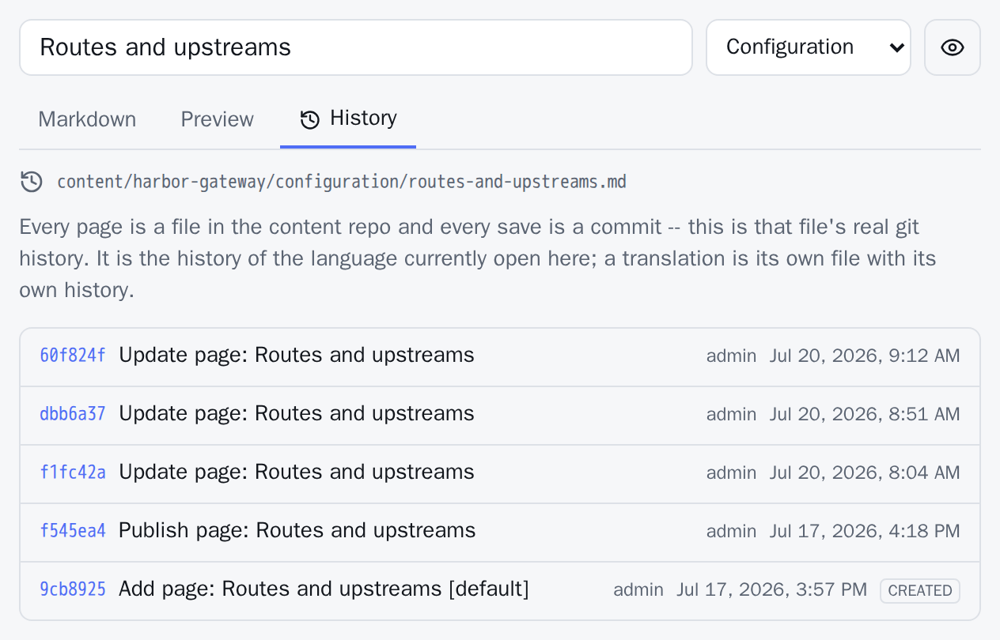
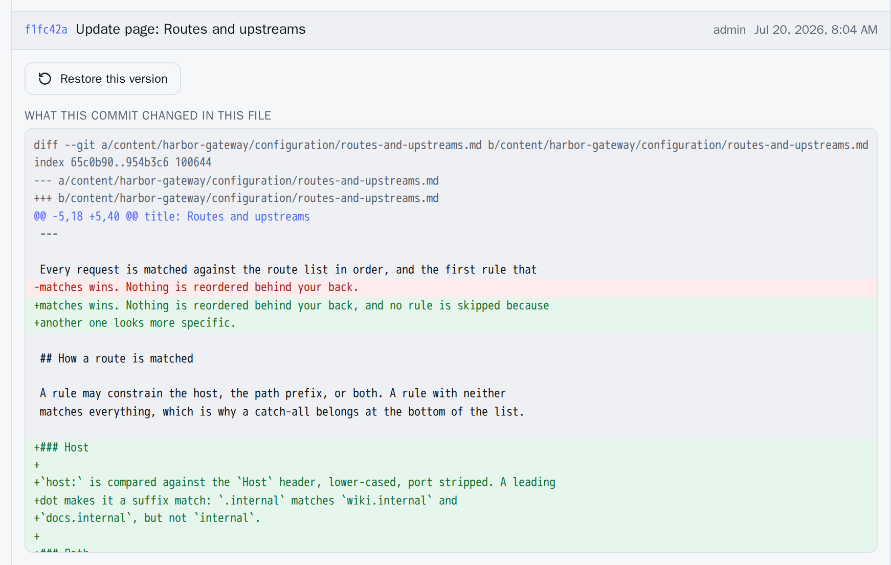

Every page is a file in a Git repository and every save is a commit, so a complete, attributed history of every page already exists. DocuWaves surfaces that history rather than keeping a second one of its own.

There is no revisions table, nothing to prune, and no retention setting. `git log` in the content repository and the app's history panel are the same answer to the same question.

## The History tab

Open a page and pick **History**, next to Markdown and Preview. It lists the commits that touched this page's file — short SHA, author, date and message, newest first. Select one and you get:

- the **Markdown that version held**, and
- a coloured **diff of what that commit changed** in this file.

The history **follows renames**. Renaming a page moves its file, and the entry that did it says which name it came from, instead of the log appearing to start over on the day of the rename. A version from before a rename is read back under the name the file had then, which is what makes it readable at all.

The first commit for a file needs no special case: its diff is the whole file as additions, and it is labelled **Created**, so you can tell that from an empty diff.

It is the history of the **language currently open**. A page's translations are separate files with separate histories, and the panel names the file it is showing.



Selecting a commit opens it in place:



## Restore

**Restore this version** writes that version's title and Markdown back as a **new commit on top**. Nothing is rewritten, reverted or deleted. The version being replaced stays in the log exactly where it is, and undoing a restore is the same button again on the commit above it.

Three things deliberately do not come back with the text:

| Not restored | Why |
|---|---|
| The page's **position** | `order` belongs to the page across all its translations; restoring one language's old position would give a reader who switches language a differently ordered sidebar |
| Whether it is **published** | That is a decision about what readers should see now, not text somebody wrote in the past. A restore must never quietly take a live page off the site |
| Its **address** | The slug is the page's URL and is shared by its translations, so an old title is written into the frontmatter while the file stays put. Links keep working |

If you do want the old title's URL back, rename the page — that is what the title field already does.

A [frozen documentation version](/p/docuwaves/pages/after-the-freeze) refuses a restore like any other write. Its history stays fully readable.

## What readers see

Nothing of the above. Commit messages, author names and diffs are **admin-only**: the content repository is usually private, and its history is your internal record. A public page shows one line at the bottom:

> Last updated: 4 March 2025

That date comes from **Git**, not from the database. The distinction matters: the database is a rebuildable index, so its `updated_at` moves whenever the index is rebuilt — by a reindex, a schema change, or a fresh clone on a new machine — none of which is a change to the page. Telling a reader a page changed on the day the container happened to restart is worse than telling them nothing.

The same date, without a time, is what `/sitemap.xml` reports as `lastmod` and what the structured data reports as `dateModified`. A page with no committed file, or an instance with no content repository configured, simply has no such line.

## Doing it from the command line

The panel is a convenience. Everything it shows is available directly:

```bash
git log --follow -- content/my-project/getting-started/installation.md
git show <sha>:content/my-project/getting-started/installation.md
git revert <sha>
```

More on working that way in [Editing in Git](/p/docuwaves/pages/editing-in-git).
