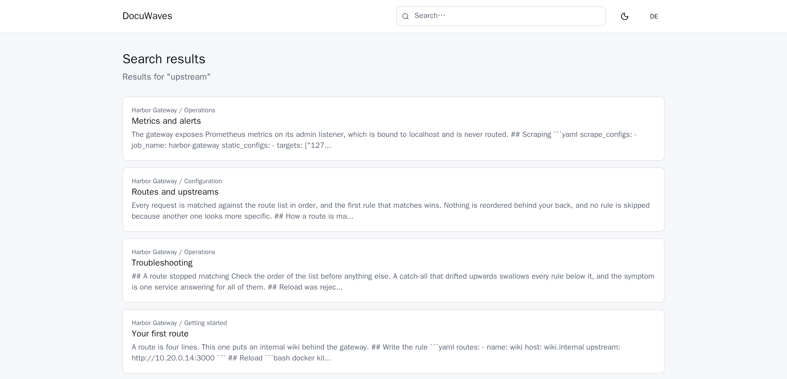
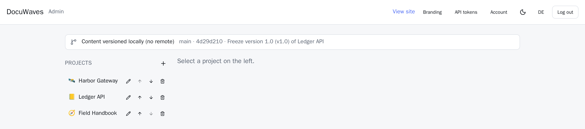

Documentation in DocuWaves has exactly three levels, and each one is a directory or a file in the content repository.

| Level | What it is | On disk |
|---|---|---|
| **Project** | One piece of software or one product | a directory with a `_project.yml` |
| **Category** | A section within it — "Getting started", "Reference" | a directory with a `_category.yml` |
| **Page** | One document | a `.md` file |

The rule of thumb for the top level: **one project per thing you ship, not per topic.** Topics are categories. A project's slug is in every URL beneath it, so splitting a single product into three projects is a decision you feel later.

## Slugs and URLs

You never type a slug. It is derived from the name or title — lowercased, with runs of spaces and punctuation collapsed into single dashes:

- `Getting Started` becomes `getting-started`
- `PostgreSQL` becomes `postgresql`
- `Projects, categories and pages` becomes `projects-categories-and-pages`

If a slug is already taken, the next one gets a `-2`, then `-3`, and so on. The admin editor and the [assistant endpoint](/p/docuwaves/pages/the-mcp-endpoint) use exactly the same function to derive it, so a page written by an assistant lands on the same URL a page written by hand would.

The reading URLs are:

```
/p/<project-slug>                          the project's category tiles
/p/<project-slug>/c/<category-slug>        one category's pages
/p/<project-slug>/pages/<page-slug>        a page
/search                                    search results
```



Note what is **not** in a page's URL: its category. A page slug is unique within its whole project, which means **moving a page to another category does not change its address**. It also means two categories in one project cannot hold a file with the same name — if that happens (through a merged pull request, say), the first one wins, the second is skipped, and the reason is listed under [Diagnostics](/p/docuwaves/pages/diagnostics) rather than silently swallowed.

**Renaming changes the slug**, which moves the file and breaks existing links to it. Rename freely before you publish; think twice afterwards.

## Order

Every project, category and page carries an `order` number. Lower sorts first. New items are appended to the end.

In the admin area, each row has **Move up** and **Move down** buttons. Pressing one swaps the `order:` value in the two affected files and commits the swap — the ordering is data in the repository, not a hidden column, so a pull request can reorder a section too.

## Editing structure

Project and category rows each have an **Edit** button:

- A **project** has a name, an icon (a single emoji), a colour, a one-line description shown on its home-page tile, and an optional [cover image](/p/docuwaves/pages/tile-cover-images).
- A **category** has a name, an icon, and an optional cover image.



**Delete** is next to Edit, behind a confirmation. Deleting a project removes its whole directory — every category, page and image in it — in one commit. Deleting a page removes all of its translations, because they are one page in several languages rather than several pages. To remove a single translation, delete that file in the content repository.

Nothing is lost by deleting, in the sense that matters: the commit that removes a file leaves it in the history, and `git revert` puts it back.

## Where the writing happens

Opening a page gives you three tabs:

- **Markdown** — the editor, with a live preview beside it. See [Markdown](/p/docuwaves/pages/markdown).
- **Preview** — the page rendered exactly as readers will see it, using the same component the public page uses.
- **History** — every commit that touched this page's file. See [Page history](/p/docuwaves/pages/page-history).

Above them sits the **Published** toggle, and on a multi-language instance a tab per language. Saving writes the file, commits it and pushes it.
